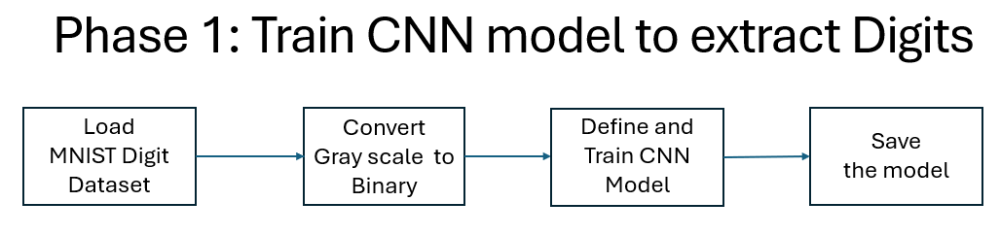
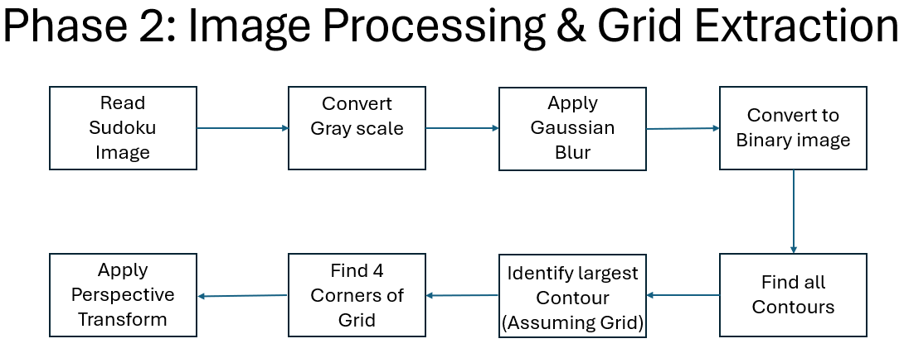
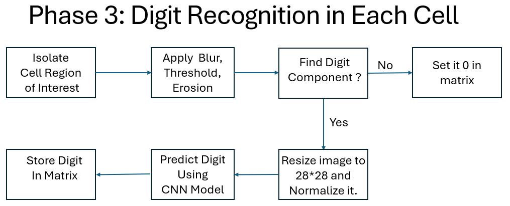
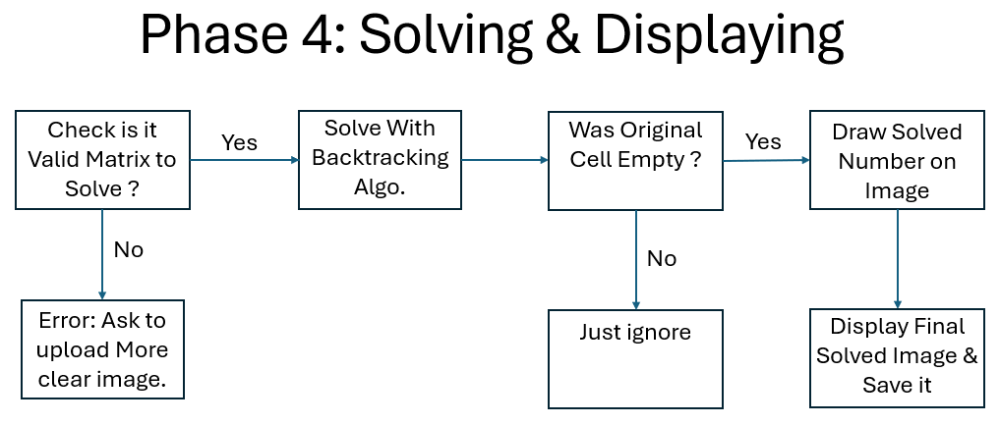

# Sudoku Solver - Computer Vision Project

## 📋 Overview
This project implements a complete Sudoku puzzle solver using computer vision and deep learning. The system can take an image of a Sudoku puzzle, detect and extract the grid, recognize the digits using a trained neural network, solve the puzzle, and display the solution.

---

## 🏗️ Project Structure

### 🔢 Phase 1: Model Training


**Deep Learning Model**: Custom CNN architecture for digit recognition  
**Dataset**: MNIST handwritten digits dataset  
**Training**: 20 epochs with 99.86% validation accuracy  

**Model Architecture**:
- 3 convolutional blocks with BatchNorm and LeakyReLU
- Adaptive average pooling
- Fully connected classifier with dropout
- Binary preprocessing for better performance

### 🖼️ Phase 2: Image Preprocessing & Grid Detection


**Input**: Sudoku puzzle image (`sudoku3.jpg`)  
**Processing Steps**:
1. Resize to 900×900 pixels
2. Grayscale conversion
3. Gaussian blur for noise reduction
4. Adaptive thresholding for binary image
5. Perspective transformation to correct grid orientation

### 🔍 Phase 3: Digit Recognition


**Cell Extraction**: Isolate individual Sudoku cells  
**Digit Classification**: Use trained CNN model to recognize digits  
**Binary Processing**: Thresholding to enhance digit visibility  
**Confidence**: High accuracy (>99%) on test dataset

### 🎯 Phase 4: Puzzle Solving & Result Display


**Solver Algorithm**: Backtracking or constraint propagation  
**Solution Overlay**: Display solved digits on original image  
**Visual Output**: Clear presentation of the final solved puzzle

---

## 🔧 Technical Details

### 🤖 Model Specifications
- **Framework**: PyTorch
- **Optimizer**: Adam (lr=1e-3)
- **Loss Function**: CrossEntropyLoss
- **Batch Size**: 128
- **Device**: GPU-accelerated training (T4 GPU)

### 🎨 Image Processing
- **Libraries**: OpenCV, scikit-image, imutils
- **Techniques**: Four-point transform, border clearing, adaptive thresholding
- **Output**: Clean, processed grid for optimal digit recognition

---

## 🚀 Usage

### 1. Training (if needed):
```python
# Model automatically trains on MNIST data
# Saved as 'model.pth'
